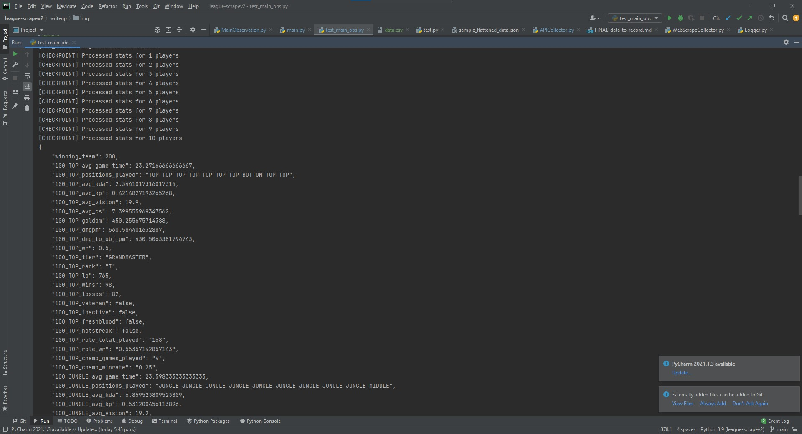

This program measures over 200 observations per game, using data taken from the Riot Games
API, and data that is scraped from LeagueOfGraphs.com.

How was this built?

TLDR: it was a combination of some smart design decisions and cobbling random code together.

## RequestSender

Riot games has a limit of 200 requests per minute, per api key. Basically, I wanted to
go faster than that, so I got multiple API keys and tried to bypass that.

Also, a lot of the riot games urls have fields to be filled in the URL eg. ".../?api_key=..."
I created a dynamic URL handling system that fills in these fields according to a user-inputted dictionary.

(this may not be ethical, but like...if you have
3 keys, you can go 3 times as fast...it's too tempting...)

**get_api_key()**: I tracked the last used time of a few API keys. get_api_key() will take the least
recently used one, sleep the appropriate amount of time, and return it to the user to be used.

**send_request()**: sends a request to a url. It uses a url template and fills in variables that the user
specifies, allowing for dynamic url usages.

## Data Collection

This part got a bit messy, because there was a lot of data to collect, and there were some technical issues
(like riot games not intending users to use more than 1 api key per product)

APICollector collects necessary data from the API, and WebScrapeCollector collects necessary data from LeagueOfGraphs.

I decided to look at stats across a user's past 10 matches(such as average kda, kill participation, cs, etc.) from the API,
and look at stats regarding a user's overall performance(eg. winrate on their current champion) from LeagueOfGraphs

## Putting things together

MainObservation has a class called GameObservation that puts together all the metrics from the data collectors.

get_allll_stats() extracts all stats that I wanted to measure from a GameObservation object, putting it into a dictionary format
([example](../planning/sample_data_json.json))

Finally, in main.py, I wrote a function that flattens the data([example](../planning/sample_flattened_data.json)).

Then I wrote get_observation() that delegates all necessary work, from getting data to processing it

Finally, I have write_observation(), that writes the observation to a CSV file.